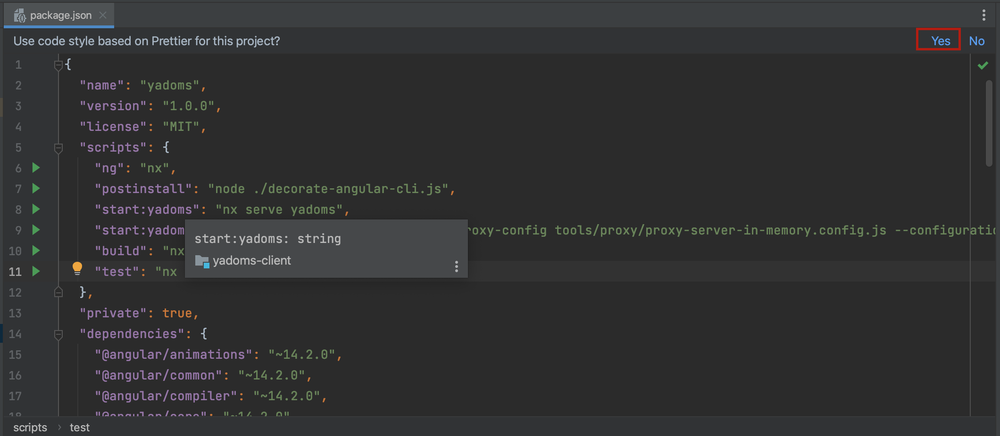
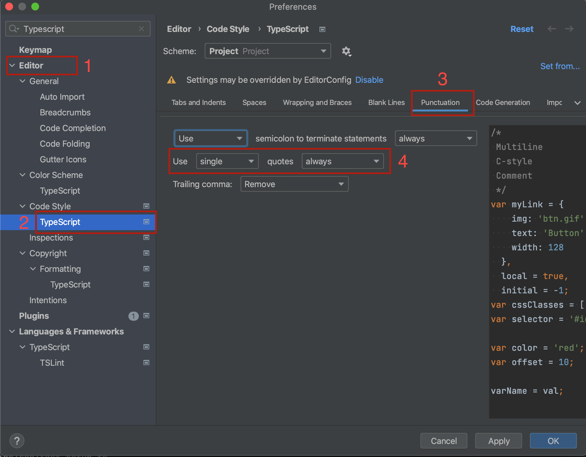

# Recommandations : 

1. Use `Intellij` IDE
2. If `Intellij` IDE used, please install `Prettier plugin` and activate it by opening `package.json` file



3. Edit typescript config to use single quote when applying `import optimization`
  On preferences 



# Nx Generation command

## Generate a library 
```
npx nx generate @nrwl/angular:library --name=core --style=scss --importPath=@yadoms/core
```

⚠️ It's possible to run all commands using debug mode to see the path of generated/edited files, this functionality could be performed by adding `--dry-run` at the end of any command

## Generate a feature library

```
npx nx generate @nrwl/angular:library --name=features/plugins --style=scss --importPath=@yadoms/features/plugins --dry-run
portPath=@yadoms/features/plugins
```
